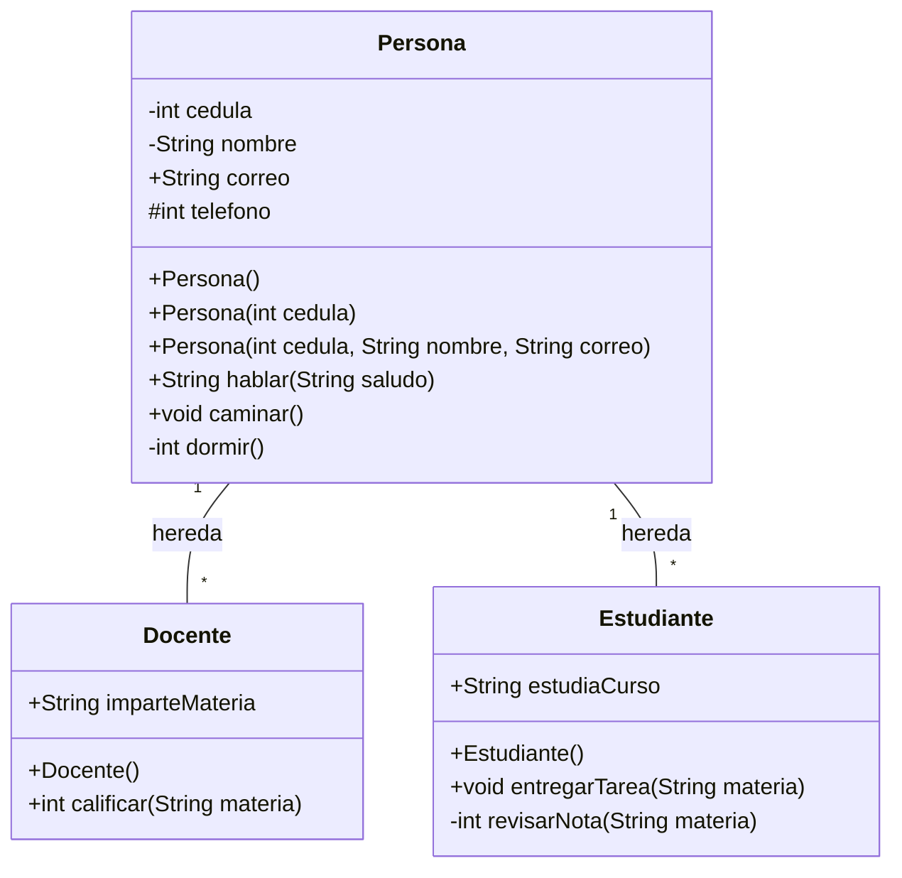
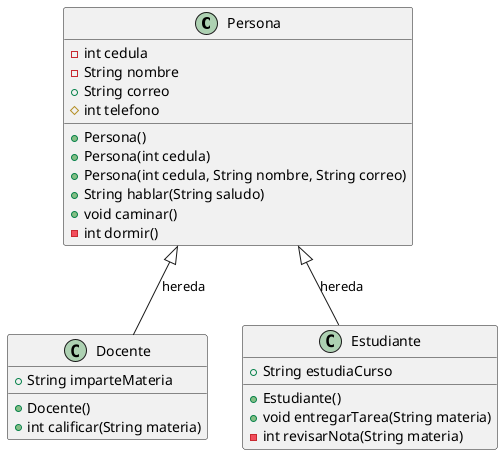
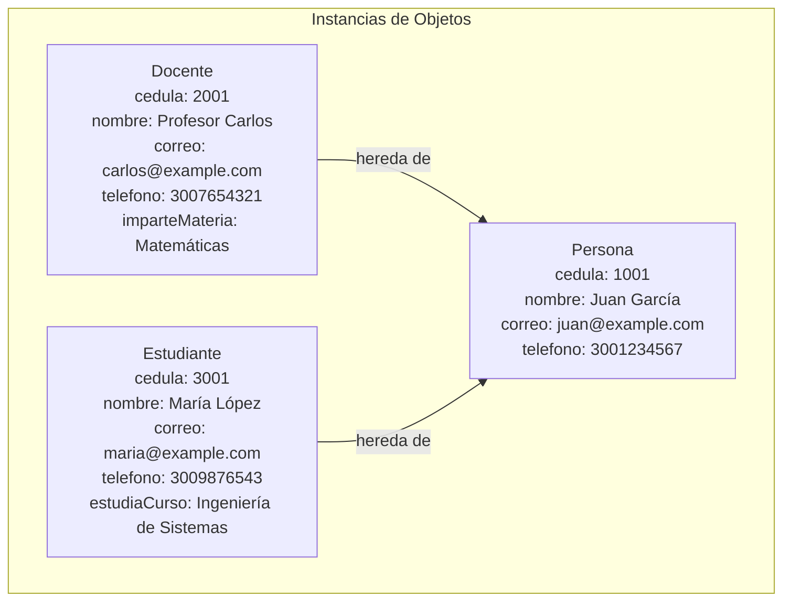

# Documentacion

## Diagrama de Clases

### Mermaid

```mermaid
classDiagram
    class Persona {
        -int cedula
        -String nombre
        +String correo
        #int telefono
        +Persona()
        +Persona(int cedula)
        +Persona(int cedula, String nombre, String correo)
        +String hablar(String saludo)
        +void caminar()
        -int dormir()
    }
    
    class Docente {
        +String imparteMateria
        +Docente()
        +int calificar(String materia)
    }
    
    class Estudiante {
        +String estudiaCurso
        +Estudiante()
        +void entregarTarea(String materia)
        -int revisarNota(String materia)
    }
    
    Persona "1" -- "*" Docente : hereda
    Persona "1" -- "*" Estudiante : hereda
```

### PlantUML

```plantuml
@startuml Diagrama_Clases_Persona_Docente_Estudiante

class Persona {
    -int cedula
    -String nombre
    +String correo
    #int telefono
    +Persona()
    +Persona(int cedula)
    +Persona(int cedula, String nombre, String correo)
    +String hablar(String saludo)
    +void caminar()
    -int dormir()
}

class Docente {
    +String imparteMateria
    +Docente()
    +int calificar(String materia)
}

class Estudiante {
    +String estudiaCurso
    +Estudiante()
    +void entregarTarea(String materia)
    -int revisarNota(String materia)
}

Persona <|-- Docente : hereda
Persona <|-- Estudiante : hereda

@enduml
```

## Diagrama de Objetos

```mermaid
graph TB
    subgraph Instancias["Instancias de Objetos"]
        P1["Persona<br/>cedula: 1001<br/>nombre: Juan García<br/>correo: juan@example.com<br/>telefono: 3001234567"]
        
        D1["Docente<br/>cedula: 2001<br/>nombre: Profesor Carlos<br/>correo: carlos@example.com<br/>telefono: 3007654321<br/>imparteMateria: Matemáticas"]
        
        E1["Estudiante<br/>cedula: 3001<br/>nombre: María López<br/>correo: maria@example.com<br/>telefono: 3009876543<br/>estudiaCurso: Ingeniería de Sistemas"]
    end
    
    D1 -->|hereda de| P1
    E1 -->|hereda de| P1
```