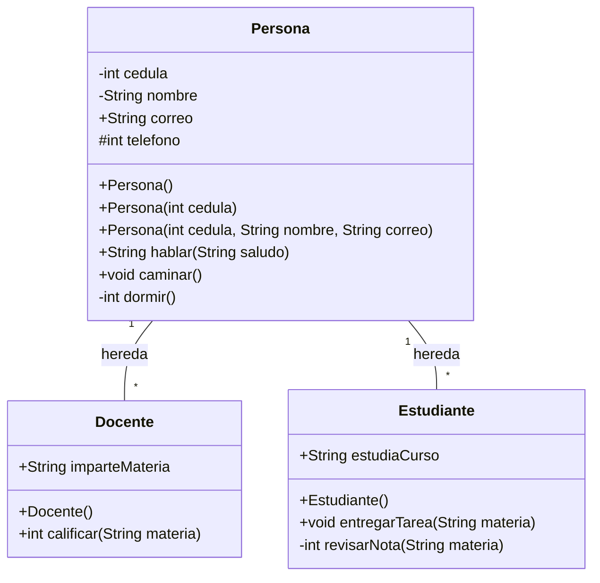

# Documentacion

## Diagrama de Clases

```mermaid
classDiagram
    class Persona {
        -int cedula
        -String nombre
        +String correo
        #int telefono
        +Persona()
        +Persona(int cedula)
        +Persona(int cedula, String nombre, String correo)
        +String hablar(String saludo)
        +void caminar()
        -int dormir()
    }
    
    class Docente {
        +String imparteMateria
        +Docente()
        +int calificar(String materia)
    }
    
    class Estudiante {
        +String estudiaCurso
        +Estudiante()
        +void entregarTarea(String materia)
        -int revisarNota(String materia)
    }
    
    Persona "1" -- "*" Docente : hereda
    Persona "1" -- "*" Estudiante : hereda
```